<!-- _class: lead -->
<!-- _paginate: false -->



> Write the algorithm once. Re-target by swapping the schedule.
> Let the compiler prove it can't deadlock.

---

## What is Nucleus?

A **two-file pre-compiler**. Every program is split in two:

- **Algorithm** (`*.algo.nuc`) — *what* to compute. Backend-agnostic.
- **Schedule** (`*.sched.nuc`) — *how* and *where* it runs.

The scheduler lowers both into a **deterministic, bounded Petri-net IR**, then projects per-worker **EventLists** that *10 backends* turn into real code.

> `schedule : (AlgoIR, SchedIR) → ( GlobalNet, { WorkerId → EventList } )`

**18 examples · 10 backends · 3 deployment tiers · bit-identical output as the oracle**

---

<!-- _class: diagram -->

## Philosophy: separate *what* from *how*



- The algorithm file holds **no** workers, buffers, or IO semantics.
- The schedule owns **placement, partition, blocking, transport, IO**.
- *Same algorithm + different schedule = a different target.*

---

## Motivation — why bother

Hand-written parallel / distributed / embedded code is:

- **Fragile** — deadlocks, races, buffer mis-sizing, off-by-one halos.
- **Non-portable** — thread code gets *rewritten* for MPI, ARM, an NPU.

Nucleus shifts correctness **left**:

- Change the schedule → never touch the algorithm.
- Change the backend → never touch the schedule.
- Boundedness + deadlock are decided **at compile time**.

> A stall is a **compile error**, not a runtime surprise.

---

## Origin & influences

- Re-derives a **2013 ISP-firmware thesis** — on hardware everyone has, with the genericity claim made *mechanically falsifiable*.
- **Borrowed (one idea):** the *algorithm / schedule split* from **Halide** (cf. TVM, Tiramisu, Exo).
- **Extended:** IO semantics — `sync` / `async` / `buffer=N` / `notify` — become **first-class schedule directives**.
- **Novel core:** lower the *whole program* onto one small **static Petri-net IR** (~500 LoC, bounded, statically-ordered).
- The model is proven by a **green tier-1 differential matrix**, not by argument.

---

<!-- _class: diagram -->

## Built clean-room, by an AI agent loop



- 3-phase lifecycle: **prd-grill → backlog-snowball → backlog-ralph**.
- One *orchestrator*, one *implementer* per task, a **mandatory read-only review gate** (qa + architect). Roles are separated *on purpose*.
- **Honest-failure discipline:** Blocked beats fake-complete; no AC-gaming.
- Scale: **~542 tasks (502 Done) · 1027 commits**.

---

## The two `.nuc` languages

| Algorithm (`*.algo.nuc`) | Schedule (`*.sched.nuc`) |
|---|---|
| `const`, `data`, shape-typed `kernel` | `workers`, `place`, `partition` |
| dataflow with `<--` over `for` | `transfer`, `check loop` |
| **forbids** workers & directives | **forbids** kernel bodies & control flow |

- Kernel bodies are **real Rust** in an adjacent file — *never* text-substituted.
- One algorithm runs under **many** schedules (example 01 ships six).

---

## A concrete example — the algorithm

`01-elementwise-add` — `c[i] = a[i] + b[i]`:

```rust
const N : usize = 256;
data a : i32[N];   data b : i32[N];   data c : i32[N];
kernel add        : (i32, i32) -> i32   pure;
kernel load_input : ()         -> i32[N] effectful;
a <-- load_input();
b <-- load_input_b();
for i : 0 .. N {
    c[i] <-- add(a[i], b[i]);
}
save_output(c);
```

*Pure* kernels reorder & dedup; *effectful* kernels keep ordering.

---

## …and the schedule decides the target

```rust
// naive.sched.nuc — everything on one worker
schedule for "../prog.algo.nuc" {
    workers = { host };
    place add on host;
    // no transfers: no cross-worker edges
}
```

```rust
// 07-matmul distributed — same algorithm, 4 workers
workers = { host, w0, w1, w2, w3 };
place madd on { w0, w1, w2, w3 };
loop i   : partition=workers;
transfer a : sync;  transfer b : sync;  transfer c : sync;
```

> Swap the file → host-only smoke test becomes a 4-worker distributed run.

---

<!-- _class: diagram -->

## The compiler pipeline



<span class="caption">Parse → lower → link → ACFG passes → <em>fork</em>: a Petri net feeds the per-build soundness gate; a per-worker EventList feeds the backends.</span>

---

<!-- _class: diagram -->

## ACFG & the injection passes



- The **ACFG** is a tree: `Operation` / `Repeat` / `Sequence`, plus *empty* `Sync` / `Xfer` slots.
- A fixed chain of pure `ACFG → ACFG` passes populates them.

---

## What each pass injects

- **`block_transform`** — strip-mines `block=N` loops into tile + inner nest.
- **partition × 3** — `workers`, `rows` (2D band), `blocks2d` (2D grid).
- **halo / reuse inference** — write sidecars for stencil overlap & loop-carried slices.
- **`sync_inject`** — barriers at cross-worker joins; elides <2-participant Syncs.
- **`transfer_inject`** — matched `Push`/`Wait` pairs per cross-worker edge.

```text
1. Sequence: prev writes W1, next reads W2, W1≠W2 → Sync{W1∪W2}
2. Repeat entry/exit: body workers differ → prepend / append Sync
4. Elision: a Sync with < 2 participants is never emitted
```

---

<!-- _class: diagram -->

## The Petri-net IR



- `Operation`/`Sync`/`Push`/`Wait` → **Transition**; per-worker **control places** thread the firing order.
- One **buffer place** per transfer: `capacity = buffer=N`, `initial_marking = pipeline depth D`.

---

## A stall is a compile error

`check_net_sound` runs on **every build** — boundedness then deadlock, over one derived firing order:

```rust
pub fn check_net_sound(net: &Net) -> Result<(), PetriAnalysisError> {
    let order = derive_firing_order(net);
    check_bounded(net, &order)?;            // capacity overflow → error
    check_deadlock_free(net, &order)?;      // reachable stall  → error
    Ok(())
}
```

Because v2 **fixes the firing order at compile time**, both properties fall out of a single deterministic replay — sound for this restricted net class (not general model checking).

---

<!-- _class: diagram -->

## EventList contract → 10 backends



- The per-worker **EventList** (`Fire`/`Push`/`Wait`/`Sync`/`Loop`) is the *sole* codegen contract — structure-preserving (rolled loops stay rolled).
- All **7 tier-1 backends emit bit-identical output** — the differential oracle.

---

## One contract, many transports

```rust
enum Event {
    Fire  { kernel, tile, bindings },
    Push  { dst, data, tile, seq },     // pair on a shared SeqTag
    Wait  { src, data, tile, seq },
    Sync  { participants, kind, sync },  // share a SyncTag
    Loop  { iter_var, range, body, .. }, // never unrolled
}
```

> One `Push` is a `memcpy` (openmp-rs), a `socket.write` (mp-tcp-event), an `MPI_Isend` (mpi-nonblocking), or a DMA enqueue (embedded). `capabilities.toml` is the committable per-backend contract; codegen **fails fast** on mismatch.

---

## Deep dive — matmul across 4 workers

```rust
for i : 0..N { for j : 0..N { for k : 0..N {
    c[i][j] <-- madd(c[i][j], a[i][k], b[k][j]);
}}}
```

```rust
place madd on { w0, w1, w2, w3 };
loop i : partition=workers;          // each worker owns an i-band
transfer a : sync;  transfer b : sync;  transfer c : sync;
```

- `partition_workers` rewrites the `i` range per worker (array_split remainder policy).
- `transfer_inject` synthesises host→worker `Push`/`Wait`; host **gathers** the bands back into `c` — bit-identical to the reference.

---

<!-- _class: diagram -->

## Tier-3: multi-MCU on real silicon



- `embedded-pattern` emits **`no_std`** firmware validated in **Renode**.
- M11: workers split across **co-simulated STM32H7 machines**, talking over a **UART hub** (`link_push` TX / `link_recv` blocking RX) — *byte-exact* across MCUs.

---

<!-- _class: stats -->

## Where it stands

**M0 → M11** milestone arc landed: skeleton → single backend → Petri-IR → distributed → tier-1 matrix → MPI → embedded/Renode → multi-MCU.

| metric | value |
|---|---|
| e2e differential | **385 total · 328 pass · 0 fail · 57 skip · 0 required-fail** |
| test suite | **1238 dev / 1237 release** |
| backlog | **~542 tasks · ~502 Done** |
| examples · backends | **18 · 10** |

Now in a **hardening wave**: prove-the-check-bites, doc-lie sweeps, dead-code audits.

---

## Future work

- **Grammar-extension epic** — the recurring bottleneck:
  - data-dependent loop termination (convergence checks)
  - in-array prefix scan · diagonal wavefront · bitonic stage-parallel
- **Fidelity upgrades** (optional):
  - real-DMA Renode shim (`TASK-0048.12`)
  - full worker-to-worker mesh (`TASK-0175` / `TASK-0337`)
  - MPI `Comm_split` for host-excluding barriers (`TASK-0045.02`)

> The synchronous shims that ship today are the *honest* definition-of-done — fidelity upgrades are tracked, not pretended.

---

<!-- _class: lead -->
<!-- _paginate: false -->

# Thank you

## Nucleus v2

> *Write the algorithm once; swap the schedule to re-target;*
> *let a Petri net prove it can't deadlock —*
> *and trust bit-identical output across ten backends as the oracle.*
